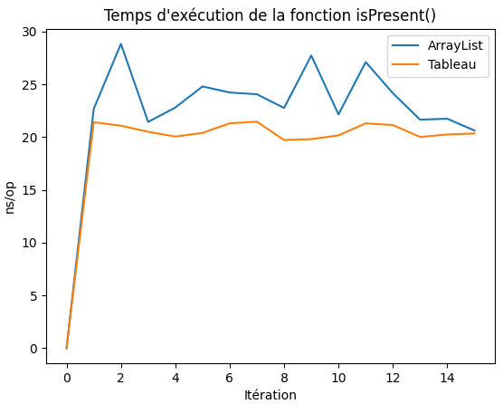
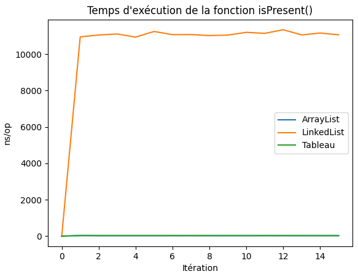
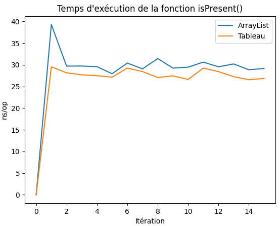
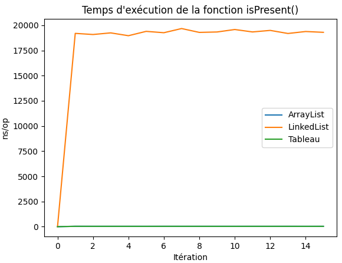
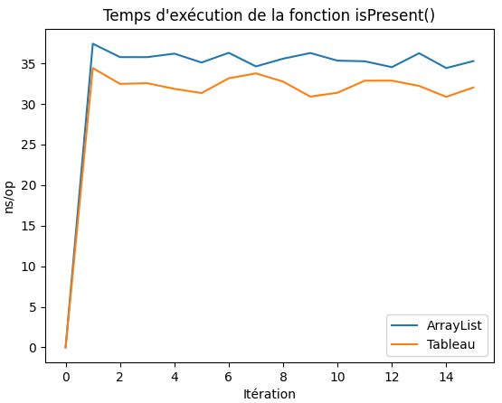
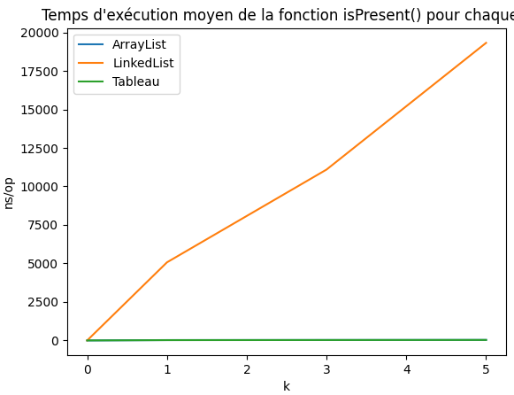
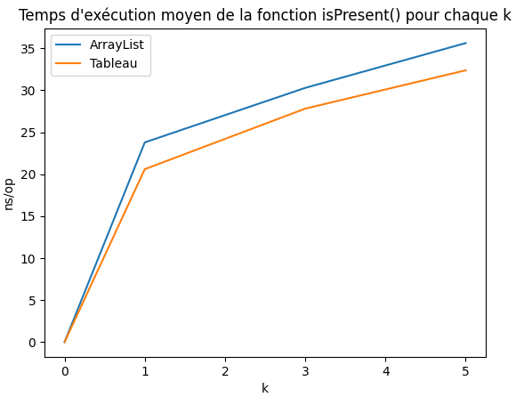
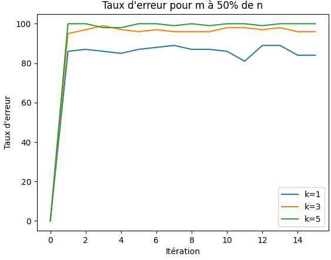
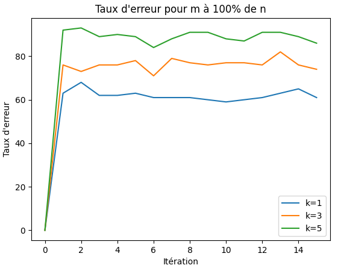
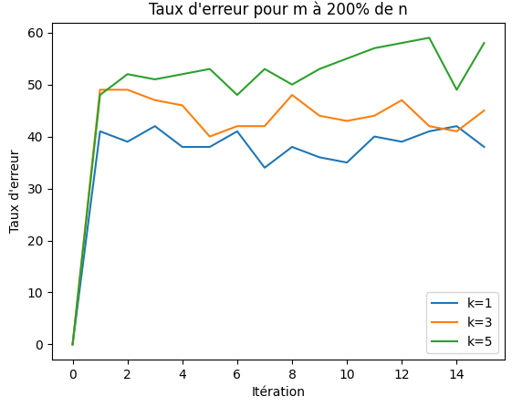

# Filtre de Bloom

## Sommaire

- [Présentation](#presentation)
- [Objectifs](#objectifs)
- [Prérequis](#prerequis)
- [Fonction de Hash](#hash)
- [Présentation de la fonction "addElement()"](#add_element)
- [Présentation et comparaison du temps d'exécution de la fonction "isPresent()"](#is_present_comparaison)
- [Taux d'erreur du test d'appartenance pour l'ArrayList](#taux_erreur)
- [Conclusion](#conclusion)

## <a id="presentation">Présentation</a>

Le Filtre de Bloom est une structure de données permettant de tester la présence ou non d'un élément. Mais il y a une certaine probabilité que lorsque le filtre détecte un élément que celui-ci n'y soit pas.

Il s'agit d'un tableau de booléens (true ou false) ou d'un tableau
de bits (0 ou 1) qui voit toutes ses cases initialisées à 0 ou false lors de son initialisation.

Il a pour attributs principaux :

- une taille notée `m`
- un nombre d'éléments à ajouter `n`
- un nombre de fonction de hachage `k` qui servira à déterminer les indices où va être placé l'élément

Pour effectuer la vérification de la présence d'un élément dans le Filtre de Bloom, il suffit de regarder si les `k` cases de l'élément sont à `1`. Mais il peut arriver qu'un élément est dit "présent" alors que celui-ci n'a pas été inséré.

Le problème vient donc de `m`, `n` et `k`. Vous pourrez voir le traitement de ce sujet plus tard dans le document.

## <a id="objectifs">Objectifs</a>

Dans ce projet vous allez donc voir l'implémentation du Filtre de Bloom avec différentes structures de données :
- `ArrayList`
- `LinkedList`
- `Tableau`

Dans le but de réaliser un `Benchmark` afin de voir quel structure de donnée est la meilleur en terme de performance. Par la suite, vous verrez le calcul du taux d'erreur du test d'appartenance sur l'`ArrayList` pour déterminer comment avoir un bon Filtre de Bloom. 

## <a id="prerequis">Prérequis</a>

- Java 7 ou supérieur
- Maven

Si le projet ne se lance pas, sur VSCode il vous suffit de faire `clean` puis `compile` sur l'onglet en bas à gauche de votre IDE qui s'appelle "MAVEN" en faisant défiler le projet "bloomfilter".
Sur NetBeans, entrez ces deux ligne de commande :
```
mvn clean -f "le chemin du pom.xml"
mvn compile -f "le chemin du pom.xml"
``` 

## <a id="hash">Fonction de Hash</a>

```java
public static int hash(int element, int k, int size) {
        int elementHash = element*k*size;
        elementHash /= k*size >> 2;
        elementHash ^= 10;
        return elementHash;
    }
```

Pour ma fonction de `hash`, je suis resté sur quelque chose de simple. Le seul calcul qui peut être compliqué à comprendre est celui de la seconde ligne. A ce moment-là, je fais un décalage de deux bit vers la droite de mon `elementHash`. J'ai essayé d'autre fonctions de `Hash` qui était encore plus simple, mais je trouvais que les indices des éléments n'étaient pas assez variables.

## <a id="add_element">Présentation de la fonction "addElement()"</a>

### Voici les fonctions pour les différentes implémentations

`ArrayList` et `LinkedList` :

```java
    public <T> void addElement(T element) {
        for(int i = 1; i <= this.k; i++){
            this.myBits.set((Math.abs(Hash.hash(element.hashCode(), i, this.size)))%(myBits.size()-1), 1);
        }        
    }
```

`Tableau` :

```java
    public <T> void addElement(T element) {
        for (int i = 1; i <= this.k; i++){
            this.myBits[(Math.abs(Hash.hash(element.hashCode(), i, this.size)))%(myBits.length-1)] = 1;
        }
    }   
```

J'ai donc mis en paramètre le type `T` qui permet de mettre n'importe quel type de donnée en paramètre (int, string, objet) afin que mon Filtre de Bloom puisse haché tout ce que je veux.

J'ai donc un attribut de classe `k`, qui correspond à mon nombre de fonction de hachage, c'est pour cela que j'itére sur mon `k`.

## <a id="is_present_comparaison">Présentation et comparaison du temps d'exécution de la fonction "isPresent()"</a>

### Voici les fonctions pour les différentes implémentations

`ArrayList` et `LinkedList` :

```java
public <T> boolean isPresent(T element) {
        boolean present = true;
        int i = 1;
        while(present && i <= this.k){
            if(this.myBits.get((Math.abs(Hash.hash(element.hashCode(), i, this.size)))%(myBits.size()-1)) != 1){
                present = false;
            }
            i++;
        }
        return present;
    }
```

`Tableau` :

```java
public <T> boolean isPresent(T element) {
        boolean present = true;
        int i = 1;
        while(present && i <= this.k){
            if(myBits[(Math.abs(Hash.hash(element.hashCode(), i, this.size)))%(myBits.length-1)] != 1){
                present = false;
            }
            i++;
        }
        return present;
    }
```

J'ai toujours en paramètre le type `T` pour la même raison que ma fonction `addElement()`. Je fais donc un parcours du Filtre de Bloom qui met un boolean à false lorsque ma fonction ne trouve pas l'élément pour la `k` fonction de hachage et le renvoie.

### Comparaison des performances

Tout d'abord, il faut savoir que les performances peuvent varier selon l'ordinateur avec lequel vous effectuez le `Benchmark`.

Nous allons faire varier le `k` afin de comparer les performances ne notre fonction. Nous fixons `n = 10000` et `m = 200% de n`. Le dernier paramètre est le `k` que nous allons changer.

```java
private ABloomFilter arrayBloomFilter = ABloomFilter.bloomFilterWithElement(10000, 200,1);
private LBloomFilter linkedBloomFilter = LBloomFilter.bloomFilterWithElement(10000, 200,1);
private TBloomFilter listBloomFilter =  TBloomFilter.bloomFilterWithElement(10000, 200, 1);
```

Pour `k = 1` :

```
Benchmark                                                       Mode  Cnt     Score    Error  Units
Benchmark.isPresentBenchmark.benchmarkOfIsPresentForArrayList   avgt   15    23,783 ±  2,614  ns/op
Benchmark.isPresentBenchmark.benchmarkOfIsPresentForLinkedList  avgt   15  5070,678 ± 81,036  ns/op
Benchmark.isPresentBenchmark.benchmarkOfIsPresentForList        avgt   15    20,596 ±  0,663  ns/op
```

Le mode `avgt` veut dire "AverageTime" ce qui signifie qu'il mesure les performances en faisant un loop, `Cnt` correspont au nombre d'itération que l'on fait, le `Score` correspond au temps moyen d'exécution sur toutes les itérations, `Error` correspond à l'écart-type et `Units` à l'unité dans laquel est affiché le résultat (nanosecondes/opérations).

Représentation graphique :

- Les trois structures de données


- Avec seulement l'`ArrayList` et le `Tableau`



Pour `k = 3` :

```
Benchmark                                                       Mode  Cnt      Score     Error  Units
Benchmark.isPresentBenchmark.benchmarkOfIsPresentForArrayList   avgt   15     30,276 ±   2,807  ns/op
Benchmark.isPresentBenchmark.benchmarkOfIsPresentForLinkedList  avgt   15  11093,777 ± 114,593  ns/op
Benchmark.isPresentBenchmark.benchmarkOfIsPresentForList        avgt   15     27,805 ±   1,048  ns/op
```

Représentation graphique :

- Les trois structures de données



- Avec seulement l'`ArrayList` et le `Tableau`



Pour `k = 5` :

```
Benchmark                                                       Mode  Cnt      Score     Error  Units
Benchmark.isPresentBenchmark.benchmarkOfIsPresentForArrayList   avgt   15     35,609 ±   0,862  ns/op
Benchmark.isPresentBenchmark.benchmarkOfIsPresentForLinkedList  avgt   15  19319,525 ± 193,597  ns/op
Benchmark.isPresentBenchmark.benchmarkOfIsPresentForList        avgt   15     32,367 ±   1,083  ns/op
```

Représentation graphique :

- Les trois structures de données



- Avec seulement l'`ArrayList` et le `Tableau`



Une représentation graphique du temps moyen pour chaque `k` :

- Les trois structures de données



- Avec seulement l'`ArrayList` et le `Tableau`



### Analyse 

Comme vous pouvez le voir sur les différents graphiques, l'`ArrayList` et le `Tableau` ont tous les deux des valeurs proche. Cela paraît logique étant donné qu'une `ArrayList` est juste un tableau extensible, on ne lui définit pas de taille particulière à la création.

On peut également constaté que la `LinkedList` est très lente et cela s'explique par son fonctionnement. Lorsque l'on souhaite accéder au contenu d'un élément de la `LinkedList`, on est obligé de créer un `Objet` ce qui ralentit de manière considérable son parcours.

## <a id="taux_erreur">Taux d'erreur du test d'appartenance pour l'ArrayList</a>

Pour calculer le taux d'erreur je fais en sorte que `m` corresponde à un certain pourcentage de `n` et je réalise 15 itérations pour chaque `k`.

```java
showPercentageOfError(1000, 50, 1, 500);
showPercentageOfError(1000, 50, 3, 500);
showPercentageOfError(1000, 50, 5, 500);
```

Le troisième paramètre de ma fonction correspond au nombre d'éléments qui n'ont pas été ajouté dont je vais tester la présence.

### m à 50% de n

```
<=============================== Taux d'erreur pour k à 1 et m à 50% de n ==============================>
                                        Taux d'erreur moyen : 86%

<=============================== Taux d'erreur pour k à 3 et m à 50% de n ==============================>
                                        Taux d'erreur moyen : 96%

<=============================== Taux d'erreur pour k à 5 et m à 50% de n ==============================>
                                        Taux d'erreur moyen : 99%
```

Représentation graphique



### m à 100% de n

```
<=============================== Taux d'erreur pour k à 1 et m à 100% de n ===============================>
                                        Taux d'erreur moyen : 62%

<=============================== Taux d'erreur pour k à 3 et m à 100% de n ===============================>
                                        Taux d'erreur moyen : 76%

<=============================== Taux d'erreur pour k à 5 et m à 100% de n ===============================>
                                        Taux d'erreur moyen : 89%
```

Représentation graphique



### m à 200% de n

```
<=============================== Taux d'erreur pour k à 1 et m à 200% de n ===============================>
                                        Taux d'erreur moyen : 38%

<=============================== Taux d'erreur pour k à 3 et m à 200% de n ===============================>
                                        Taux d'erreur moyen : 44%

<=============================== Taux d'erreur pour k à 5 et m à 200% de n ===============================>
                                        Taux d'erreur moyen : 53%
```

Représentation graphique



### Analyse 

Nous pouvons constater que plus on prend un `m` grand et plus le taux d'erreur est faible. De plus, quand le `k` est petit le taux d'erreur est réduit. Cela est normal étant donné que l'on place l'élément dans `k` indice, donc plus le `k` est grand et plus le Filtre de Bloom est rempli, ce qui produit des erreurs.

## <a id="conclusion">Conclusion</a>

On peut en déduire que pour avoir un Filtre de Bloom efficace il vaut mieux opter pour l'`ArrayList` ou le `Tableau`. Mais étant donné que l'on défini la taille lors de la création du filtre, le choix le plus judicieux serait le `Tableau`.

Pour limiter le taux d'erreur il faut avoir une taille qui est beaucoup plus grande que celle du nombre d'élément que l'on souhaite insérer. J'ai fait mes test jusqu'à une taille de 200% de `n` et au vu des résultats je pense que l'idéal serait d'avoir une taille de 500%. Mais il vaudrait mieux faire des tests afin de pouvoir valier mon opinion. 